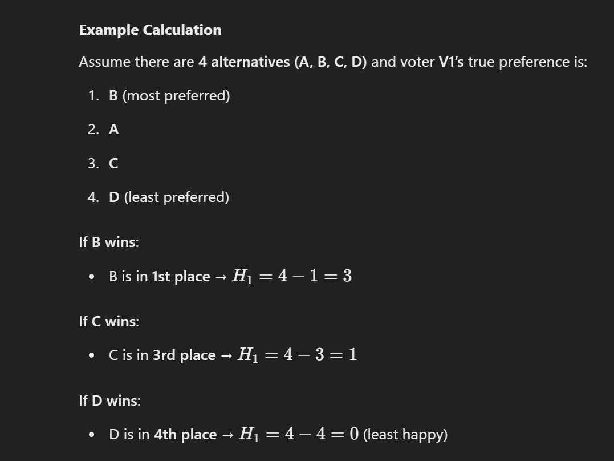

# TVA-AMAS

# Definitions

## Strategic Voting

Strategic voting means that at least one of the involved voters supports an alternative (possible
outcome, candidate) other than her/his sincere (true, honest) preference in order to achieve a voting outcome
that is more desirable (in terms of voter happiness level) for this voter than the outcome that would result
from non-strategic (sincere) voting.
Strategic voting results in the change (increase or decrease) of the overall score of at least one alternative.
This can be achieved in a number of ways, thus different types of strategic voting in single-round voting
settings can be distinguished, such as:
• Compromising – ranking an alternative insincerely higher than another
• Burying – ranking an alternative insincerely lower than another
• Bullet voting – voting for just one alternative, despite having the option to vote for several

Another type of strategic voting that applies in round-based voting is push-over: ranking an “easy to beat”
alternative insincerely higher than another in the first round(s) in order to increase the chance to win of the
true preference in the final round. An example of a two-round voting is runoff voting. In this Lab we only deal
with single-round voting and thus push-over strategic voting is not considered.

## Strategic Voting Risk

The Strategic Voting Risk (SVR) refers to the probability or likelihood that a given voting system is susceptible to strategic voting, meaning that voters have an incentive to misrepresent their true preferences in order to achieve a more desirable outcome.

More formally, strategic voting risk can be defined as:

The probability that, in a given election setting, at least one voter can benefit from casting a strategic (insincere) vote rather than voting sincerely, leading to a different election outcome that is more favorable to them.

SVR is often studied in computational social choice and voting theory, where researchers analyze how different voting rules (e.g., plurality, Borda count, approval voting) are affected by strategic manipulation. The degree of risk depends on factors such as:

- The voting rule used

- The number of candidates and voters

- The distribution of sincere preferences

- The presence of knowledge about other voters' preferences

A voting system with high strategic voting risk means that voters frequently have an incentive to vote strategically, potentially distorting election outcomes. Conversely, a system with low strategic voting risk is more resistant to manipulation and encourages truthful preference expression.

Example related to the number of voters

```
There are 5 voters, and they have the following sincere (honest) preferences:

Voter	1st Choice	2nd Choice	3rd Choice
V1	A	B	C
V2	A	B	C
V3	B	A	C
V4	B	C	A
V5	C	B	A
Now, let’s analyze what happens under Plurality Voting (where each voter casts a vote only for their top preference).

Sincere (Non-Strategic) Voting Outcome:
Each voter votes for their top choice:

Alice (A) gets 2 votes (from V1, V2)
Bob (B) gets 2 votes (from V3, V4)
Charlie (C) gets 1 vote (from V5)
➡️ Result: A tie between Alice and Bob. A tiebreaker is needed.

Strategic Voting Risk:
Voter V3, who prefers B > A > C, realizes that if they vote sincerely for Bob, it will result in a tie between A and B. However, if they strategically vote for Alice instead of Bob, they can prevent the tie.

Strategic Voting by V3:
If V3 votes for Alice instead of Bob:

Voter	Vote Cast
V1	A
V2	A
V3	A (strategic vote)
V4	B
V5	C
Alice (A) now gets 3 votes
Bob (B) gets 1 vote
Charlie (C) gets 1 vote
➡️ Alice wins outright, avoiding the tiebreaker.

Voter V3 strategically changed their vote to manipulate the election outcome. This is an example of strategic voting risk because the voting system allowed a voter to gain an advantage by misrepresenting their true preference.
```


## Happiness Level

Hi=m−rank of winning alternative in voter’s preference list
where:

m = total number of alternatives (candidates)

Rank of winning alternative = the position of the winning alternative in the voter's true preference list (1st place = best, mth place = worst).



We can also make a quadratic happiness model.

Hi=(m−rank of winning alternative)^2

This gives more weight to higher-ranked outcomes, making happiness drop faster as the winner moves further down a voter's preference list.
It emphasizes that a voter is much happier with their top choice than with a second or third option.


## Overall Happiness Level

Sum of happiness of all agents, so we just calculate the summation. We can compare the overall happiness in different scenarios.
